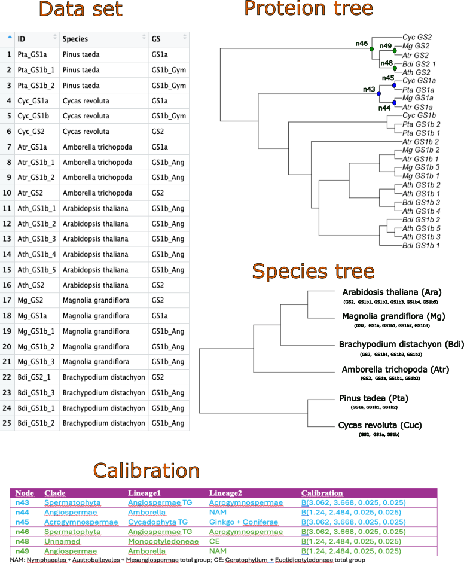

```{r setup, include=FALSE}
knitr::opts_chunk$set(echo = TRUE)
```

## Disclaimer

This tutorial is for my own use. However, I am making it public in case it would be equally useful to others. Anyway, I must point that I don't pretend to be neither original nor creative. Thus, I may have copied both ideas and text chunks from different public sources that are acknowledge herein:

* Dating Microbial Evolution with MCMCtree (Methods Mol Biol. 2022:2569:3-22. doi: 10.1007/978-1-0716-2691-7_1)

* PAML Manual (https://github.com/abacus-gene/paml)

* Mario dos Reis, Sandra Álvarez-Carretero and Ziheng Yang.
(http://abacus.gene.ucl.ac.uk/software/MCMCtree.Tutorials.pdf)

* Sandra Álvarez-Carretero. (https://github.com/sabifo4/Tutorial_MCMCtree)

* Jun Inoue (https://fish-evol.org/mcmctreeExampleVert6/text1Eng.html)

* MCMCtreeR: plotting time trees. Puttick, M. 2019 (https://github.com/PuttickMacroevolution/MCMCtreeR/)

* Bayesian MCMC phylogenetics tutorial in R (http://github.com/thednainus/Bayesian_tutorial)


## Input Data

* An alignment in phylip format (MCMCtree_GS_tutorial/data/representatives.phy) of 25 GS plant proteins from six representative plant species.

* A calibrated tree of the 25 proteins (MCMCtree_GS_tutorial/data/representatives.tre)

&nbsp;

{ width="600" height="700" style="display: block; margin: 0 auto" }
The tree calibration was done using fossil dating data provided at (Clarke, Warnock and Donoghue, 2011), and summarized in the figure above.

## Workflow

The steps we will follow to estimate the divergence times using the approximate likelihood method are:

1. Estimate the MLEs of the branch lengths, gradient vector and Hessian matrix using CODEML,

2. Conduct MCMC sampling of the posterior of times and rates using MCMCtree.

3. Carry out diagnostic test of MCMC convergence to the posterior distribution.

4. Conduct MCMC sampling of the prior of times and rates using MCMCtree.

### MLE of the branch lengths, gradient and Hessian

For this purpose we will open the terminal and browse to the `MCMCtree_GS_tutorial/wb`, a working-bench directory where the output files will be stored. Then type:

`mcmctree ../GH/representatives_outBV.ctl`


This control (ctl) file can be opened using a suitable text editor and it will look like:

```
       seqfile = ../data/representatives.phy 
      treefile = ../data/representatives.tre

         ndata = 1
       seqtype = 2    * 0: nucleotides; 1:codons; 2:AAs
       usedata = 3    * 0: no data (prior); 1:exact likelihood; 
                      * 2: approximate likelihood; 3:out.BV (in.BV)
         model = 2    * 0: poisson; 1: proportional; 2:Empirical; 
	                    * 3: Empirical+F; 6: FromCodon; 8: REVaa_0; 9: REVaa(nr=189) 
         alpha = 0.5  * alpha for gamma rates at sites
         ncatG = 5    * No. categories in discrete gamma
    aaRatefile = lg.dat * Amino acid substitution model rate matrix

     cleandata = 0    * remove sites with ambiguity data (1:yes, 0:no)?
```
The first two lines give the path to the alignment and tree files used as input. Then, `ndata = 1` indicates that the alignment is contained in one partition. If your alignment is divided into two or more partitions, then you need to compute a set of branch lengths, gradient and Hessian for each partititon. The next line indicates that we are dealing with amino acids. Then, `usedata = 3` indicates we want to estimate the necessary MLEs for approximate likelihood calculation. The remaining lines indicate that we will use an empirical amino acid substitution matrix (the LG model stored in the `lg.dat` file present at `MCMCtree_GS_tutorial/GH/lg.dat`) with a discret gamma model of rate variation among sites (with 5 categories). 
MCMCtree will use the information of this `ctl` file to prepare input files for CODEML that will compute the MLEs branch lengths, gradient and Hessian, which will be stored in an output file called `out.BV`. Move this file to `MCMCtree_GS_tutorial/MCMC` and renamed it as `in.BV`. 

### MCMC sampling the posterior of times and rates

In the `MCMCtree_GS_tutorial/MCMC` you will find the control file (`representatives_mcmc.ctl`) necessary for this task, whose content is shown below.

```
          seed = -1       
       seqfile = ../data/representatives.phy
      treefile = ../data/representatives.tre
      mcmcfile = mcmc.txt
       outfile = out.txt

         ndata = 1
       seqtype = 2                 * 0: nucleotides; 1:codons; 2:AAs
       usedata = 2 ../MCMC/in.BV   * 0: no data (prior); 1:exact likelihood;
                                   * 2: approximate likelihood; 3:out.BV (in.BV)
         clock = 2                 * 1: global clock; 2: independent rates; 3: correlated rates
         
         RootAge =  '<8.0'
         
         BDparas = 1 1 0           * birth, death, sampling
     kappa_gamma = 6 2             * gamma prior for kappa
     alpha_gamma = 1 1             * gamma prior for alpha

     rgene_gamma = 2 40 1          * gammaDir prior for rate for genes
    sigma2_gamma = 1 10 1          * gammaDir prior for sigma^2     (for clock=2 or 3)

           print = 1               * 0: no mcmc sample; 1: everything except branch rates 2: all 
          burnin = 1000
        sampfreq = 20
         nsample = 20000

```
Note the line with `usedata = 2` indicating that the sampling of the posterior distribution will be conducted using approximate likelihood. Line `clock = 2` set an independent rate model. MCMCtree uses a birth-death process to specify the prior on node ages without fossil calibrations. Here, we use `DBparas = 1 1 0`, which specifies a uniform prior. Lines `rgene_gamma` and `sigma2_gamma`specify the gamma prior on the mean evolutionary rate and on the rate dispersion parameter of the relaxed-clock models. It is important to specify a sensible rate prior. If the mean on the prior rate is too high or too low, it will be in conflict with the fossil calibrations and may affect the posterior distribution of times. Herein, we use  `rgene_gamma = 2 40 1`, which specifies a gamma distribution with mean = 2/40 = 0.05 amino acid substitution per 100 million years, which is the same used by (dos Reis, 2022) and within the order of magnitude expected in ancient phylogenies and not far away from the 0.08 amino acid substitution per 100 million years attributable to gymnosperms (De La Torre *et al* 2017). The last thee lines control MCMC sampling. Here, we use `burning = 1000` which means we will discard the first 1000 iterations. The line `sampfreq = 2` indicates that every two iteractions we take one sample. The command `nsample = 20000` indicates that we will collect 20000 samples. Thus, the total number of iterations in our MCMC process will be N = 1000 + 20 x 20000 = 401000.

To run the MCMC sampling, navigate to the `wb` directory in the terminal and then type: `mcmctree ../MCMC/representatives_mcmc.ctl`. Once MCMCtree is finished, several new files will have been created. File `out.txt` contains a summary of the analysis. At the bottom of the file, a table with all the node ages is provided. Another output file is `FigTree.tre`, which contain the dated phylogeny, suitable for plotting with `FigTree` or `MCMCtreeR`. For instance,

```{r}
# Install the MCMCtreeR package if necessary:
if (!any(rownames(installed.packages()) == "MCMCtreeR")) install.packages("MCMCtreeR")
library(MCMCtreeR, quietly = TRUE, warn.conflicts = FALSE)

# 'phy' and 'pos' are the tree and posterior distribution of time divergence
phy <- readMCMCtree("./output/FigTree1.tre")
posterior <- read.csv2("./output/mcmc1.txt",
                       sep = "\t")
posterior <- sapply(posterior, as.numeric)
pos <- as.data.frame(posterior)

MCMC.tree.plot(phy,
               analysis.type = "MCMCtree",
               MCMC.chain = pos,
               cex.tips = 0.2,
               time.correction = 100,
               scale.res = c("Eon", "Period"),
               plot.type = "distributions",
               cex.age = 0.6,
               cex.labels = 0.6,
               relative.heigh = 0.08,
               col.tree = "gray40",
               label.offset = 4,
               no.margin = TRUE,
               density.col = "darkgreen",
               density.border.col = "black")
```

### MCMC Diagnostic

An MCMC sample is guaranteed to converge to the posterior distribution as the size of the sample approaches infinity. In practice, however, there is no guaranteed that an MCMC has been running long enough, and thus a given MCMC sample may be too short and poor approximation to the posterior. The way to 
avoid poor MCMC samples is to run the analysis several times and compare the results. If the results from different runs are very similar, then we can have some confidence that the MCMC have converged to the posterior distribution we are searching for. In the `MCMCtree_GS_tutorial/output` directory we have output files from two independent runs. Let's start loading the posterior samples:

```{r}
pos1 <- read.csv2("./output/mcmc1.txt", sep = "\t", header = TRUE)
pos2 <- read.csv2("./output/mcmc2.txt", sep = "\t", header = TRUE)
pos1 <- as.data.frame(sapply(pos1, as.numeric))
pos2 <- as.data.frame(sapply(pos2, as.numeric))
```

#### Posterior means

Afterwards, we will compute the posterior mean for the divergence time at each node and for both samples, ploting one agains the other.

```{r}
ti <- grep("t_", names(pos1))
t.mean1 <- colMeans(pos1[, ti])
t.mean2 <- colMeans(pos2[, ti])
plot(t.mean1, t.mean2)
abline(0,1, lty = 2)
```

As we can see, the posterior means are similar between the two MCMC runs, which is a good indication of convergency.

#### Density histogram of GS2/GS1 and GS1a/GS1b divergence ages

```{r}
par(mfrow = c(1,2))
root <- which(names(pos1) == "t_n26")
plot(density(pos1[,root]), col = "blue", lty = 2, main = "Density GS2/GS1 age")
lines(density(pos2[,root]), col = "red", lty = 2)
gs1ab <- which(names(pos1) == "t_n27")
plot(density(pos1[,gs1ab]), col = "blue", lty = 2, main = "Density GS1a/GS1b age")
lines(density(pos2[,gs1ab]), col = "red", lty = 2)
par(mfrow = c(1,1))
```

#### Trace and autocorrelation plots of root age

```{r}
par(mfrow = c(1,2))
plot(pos1[,root], ylab = "Posterior", ty = 'l', main = "Trace plot of root")
acf(pos1[,root], main = "Autocorrelation of root age")
par(mfrow = c(1,1))
```


Not dense trace plots and high autocorrelation are symptos of inefficient chains (chains that have not yet converged).  

#### Effective sample size

The MCMC process causes the draws to be correlated, which is an unwanted effect. This means that the effective sample size is generally lower than the number of draws. For this reason, the effective sample size – rather than the actual sample size – is typically used when determining if an MCMC model has converged.

```{r}
# Install the coda package if necessary:
if (!any(rownames(installed.packages()) == "coda")) install.packages("coda")
library(coda, quietly = TRUE, warn.conflicts = FALSE)

ESS <- effectiveSize(pos1[,root])
pc <- round(100 * ESS/nrow(pos1), 2)

print(paste("ESS = ", ESS, " which is a  ", pc, " % of the actual sample size"))
```

For a review on the practical aspects of MCMC sampling you can read (Nascimento, dos Reis and Yang, 2017). 

### Sampling from the prior

In a phylogeny, nodes must be older than their daughter nodes. This constraint must be applied during MCMC sampling when node ages are proposed, and this results in truncation of the fossil calibration densities used. In other words, the calibration density applied to a node may be very different to the marginal prior used during MCMC sampling after truncation (Warnock *et al* 2014). Therefore, it is advisable to run an MCMC with "no data" to sample from the prior and thus verify that the actual priors on node ages are sensible. To this end, we have change a line in the control file (see `representatives_prior.ctl`).


```
          seed = -1       

       seqfile = ../data/representatives.phy
      treefile = ../data/representatives.tre
      mcmcfile = mcmc_prior.txt
       outfile = out_prior.txt

         ndata = 1
       seqtype = 2         * 0: nucleotides; 1:codons; 2:AAs
       usedata = 0         * 0: no data (prior); 1:exact likelihood;
                           * 2: approximate likelihood; 3:out.BV (in.BV)
         clock = 2         * 1: global clock; 2: independent rates; 3: correlated rates
         
         RootAge = '<8.0'

         BDparas = 1 1 0   * birth, death, sampling
     kappa_gamma = 6 2     * gamma prior for kappa
     alpha_gamma = 1 1     * gamma prior for alpha

     rgene_gamma = 2 40 1  * gammaDir prior for rate for genes
    sigma2_gamma = 1 10 1  * gammaDir prior for sigma^2     (for clock=2 or 3)

           print = 1       * 0: no mcmc sample; 1: everything except branch rates 2: all 
          burnin = 1000
        sampfreq = 40
         nsample = 20000
```

Note that `usedata = 0`tells MCMCtree to carry out sampling from the prior. Now, in the terminal browse to `MCMCtree_GS_tutorial/wb` and type: `mcmctree ../prior/representatives_prior.ctl`. Once MCMCtree has finished, you will see the output files `mcmc_prior.txt`, `out_prior.txt`, and `FigTree_prior.tre`, which in this case contain the prior sample and prior summaries, and can be used to plot the calibration densities and the marginal prior.

## References 

* Clarke JT, Warnock RCM, Donoghue PCJ. 2011. Establishing a time-scale for plant evolution. *New Phytologist* **192**:266-301. 

* De La Torre AR, Li Z, Van de Peer Y, Ingvarsson PK. 2017. Contrasting rates of molecular evolution and patterns of selection among gymnosperms and flowering plants. *Mol Biol Evol* **34**:1363-1377.

* Nascimento FF, dos Reis M, Yang Z. 2017. A biologist's guide to Bayesian phylogenetic analysis. *Nature Ecology and Evolution* **1**:1446-1454.

* Warnock RCM, Parham JF, Joyce WG, Lyson TR, Donoghue PCJ. 2014. Calibration uncertainty in molecular dating analyses: there is not substitute for the prior evaluation of time priors. *Proc Biol Sci* **282**:20141013.


